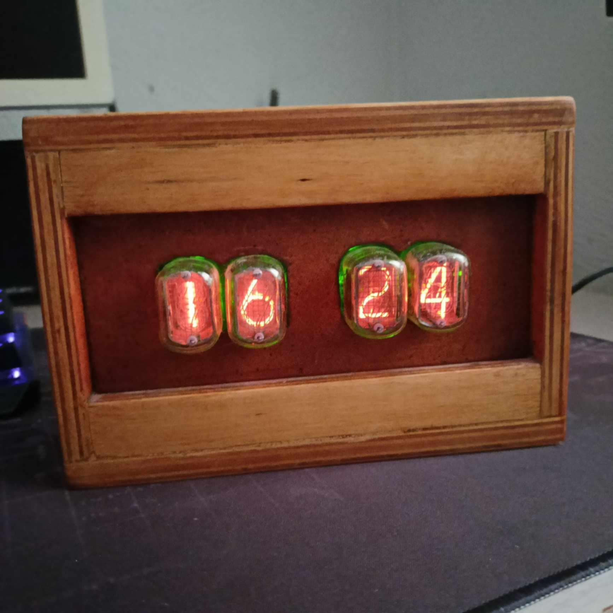

Zegar Nixie

To projekt zegara cyfrowego z lampami Nixie In-12. Używa mikrokontrolera Arduino oraz modułu DS1307 do pomiaru czasu. Zegar wyświetla godzinę w formacie 24-godzinnym, umożliwia ustawienie godziny i minut za pomocą przycisków. Wyświetlanie czasu odbywa się za pomocą techniki multipleksowania. 

Funkcje:

Wyświetlanie czasu na wyświetlaczach Nixie

Ustawianie godziny i minut za pomocą przycisków

Obsługa RTC (Real Time Clock) za pomocą modułu DS1307

Więcej szczegółów z etapów budowy:

https://www.elektroda.pl/rtvforum/topic3775869.html
